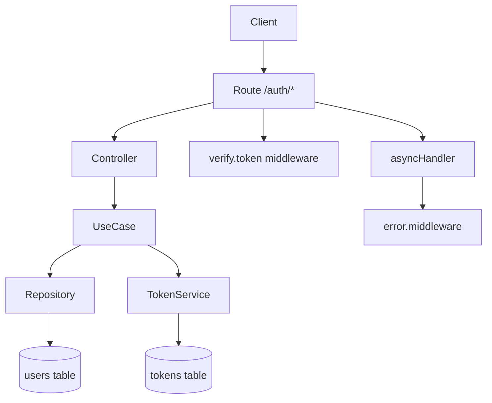
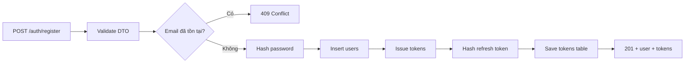
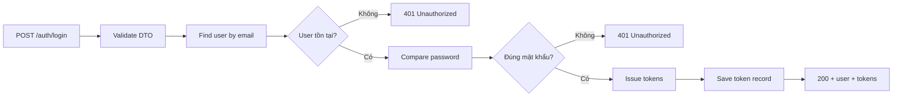
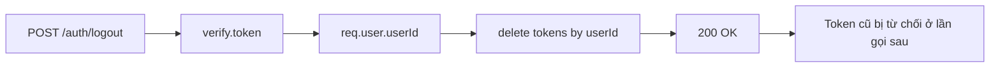

# Tài Liệu Tổng Hợp Luồng Auth (Toàn Bộ Module)

Tài liệu này mô tả toàn bộ luồng trong module xác thực theo kiểu dễ đọc cho team: bắt đầu từ bài toán, đi qua từng luồng chạy thực tế, nêu rõ tác dụng từng phần, và chốt lại các lỗi đã gặp cùng cách xử lý.

## 1. Bài Toán Team Cần Giải

Hệ thống cần cho người dùng:

- Đăng ký tài khoản.
- Đăng nhập để lấy token truy cập.
- Đăng xuất để thu hồi token đã cấp.

Nếu chỉ phát JWT mà không quản lý trạng thái trong DB, thao tác logout sẽ không có hiệu lực thực sự. Vì vậy module hiện tại chọn cách lưu thông tin token theo user trong bảng `tokens`, kết hợp verify theo public key của user để có thể thu hồi phiên rõ ràng.

## 2. Kiến Trúc Luồng Tổng Quan

Ý nghĩa nhanh:

- Controller chỉ nhận/trả dữ liệu HTTP.
- UseCase chứa nghiệp vụ.
- Repository làm việc với DB.
- Middleware lo xác thực và gom lỗi async.

## 3. Luồng Đăng Ký

Khi client gọi `POST /auth/register`, hệ thống xử lý theo trình tự:

1. Validate dữ liệu đầu vào qua DTO.
2. Kiểm tra email đã tồn tại hay chưa.
3. Hash mật khẩu bằng bcrypt.
4. Tạo user trong bảng `users`.
5. Tạo access token và refresh token.
6. Hash refresh token trước khi lưu DB.
7. Lưu key pair và refresh token hash vào bảng `tokens`.
8. Trả về user + token gốc cho client.

## 4. Luồng Đăng Nhập

Khi client gọi `POST /auth/login`, hệ thống xử lý:

1. Validate dữ liệu email/password.
2. Tìm user theo email.
3. So sánh password với hash trong DB.
4. Nếu đúng, cấp token mới.
5. Cập nhật/lưu thông tin token trong bảng `tokens`.
6. Trả user + tokens.

## 5. Luồng Verify Token Cho Route Private

Khi route cần đăng nhập, middleware `verify.token` sẽ chạy trước controller.

Luồng xử lý:

1. Đọc header Authorization.
2. Tách token theo dạng `Bearer <token>`.
3. Decode token để lấy `userId`.
4. Lấy public key của user từ bảng `tokens`.
5. Verify chữ ký token.
6. Hợp lệ thì gắn payload vào `req.user`.

Sau bước này, controller có thể dùng:

- `req.user.userId`
- `req.user.email`
- `req.user.role`
- `req.user.iat`
- `req.user.exp`

## 6. Luồng Đăng Xuất (Thu Hồi Phiên)

Khi client gọi `POST /auth/logout`:

1. Route đi qua `verify.token` để đảm bảo token hợp lệ.
2. Controller lấy `req.user.userId`.
3. UseCase gọi repository xóa bản ghi token theo user.
4. Trả response thành công.

Tác dụng thực tế: token cũ sẽ không còn dùng được trên route private vì hệ thống không còn tìm thấy keystore để verify.

## 7. Luồng Bắt Lỗi Tập Trung

Các handler async được bọc bởi `asyncHandler` để tránh lặp `try/catch` ở mọi controller.

Khi có lỗi async:

1. Promise reject.
2. `asyncHandler` gọi `next(error)`.
3. `error.middleware` nhận lỗi và chuẩn hóa response.

Kết quả là toàn bộ API có format lỗi đồng nhất, dễ đọc log và dễ debug bằng Postman.

## 8. Những Lỗi Đã Gặp Và Bài Học

Lỗi 1: verify token báo lỗi do inject sai thứ tự dependency.

- Nguyên nhân: truyền nhầm thứ tự constructor của `TokenServiceImpl`.
- Cách xử lý: chuẩn hóa thứ tự `(tokenRepository, jwtSecurity)`.

Lỗi 2: thao tác verify trả Promise gây lỗi ngầm.

- Nguyên nhân: thiếu `await` khi gọi hàm verify async.
- Cách xử lý: chuyển middleware sang async và await đầy đủ.

Lỗi 3: SQL update token không chạy nhánh update.

- Nguyên nhân: DB thiếu UNIQUE cho `tokens.user_id`.
- Cách xử lý: bổ sung constraint UNIQUE đúng schema.

## 9. Cách Dùng Nhanh Cho Thành Viên Team

Khi viết route mới:

- Nếu là route công khai: map controller trực tiếp.
- Nếu là route cần đăng nhập: bọc `verify.token` trước controller.
- Nếu controller là async: bọc thêm `asyncHandler` để lỗi đi đúng luồng.

## 10. Trạng Thái Hiện Tại Của Module

Đã hoàn thành:

- Register
- Login
- Logout
- Verify token cho route private
- Bắt lỗi async tập trung

Chưa làm:

- Refresh token endpoint
- Quy trình rotate refresh token đầy đủ
- Phân quyền chi tiết theo role ở từng nhóm route
